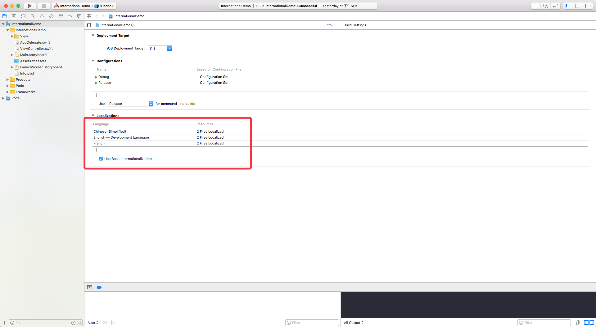
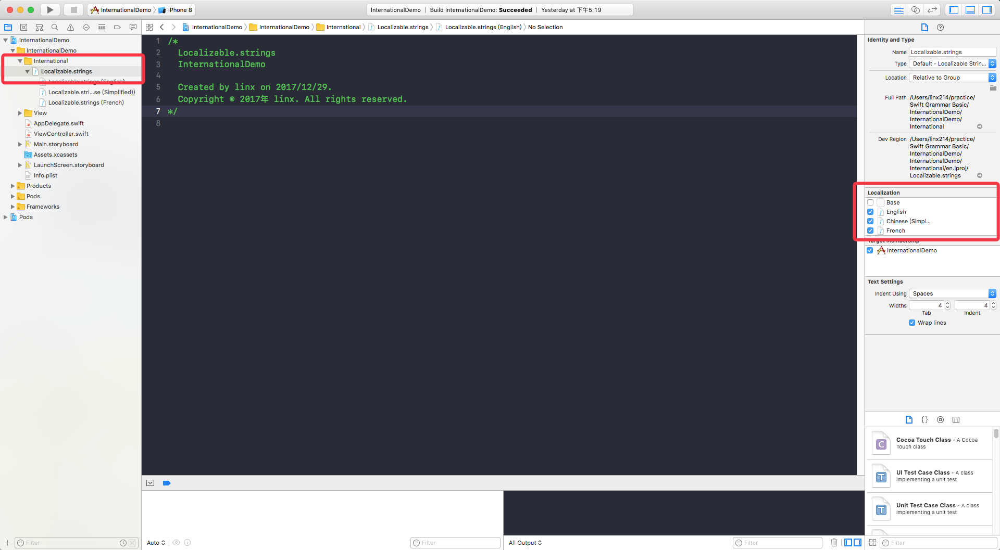

## iOS国际化支持

一、背景
================
最近一个项目中需要使用到不同国家语言的切换，包括UI控件的语言切换，最好是能够实现动态的切换，不引起页面刷新操作，提高用户体验。

Xcode Version 9.1 (9B55)
Swift Version 4.0.2

二、技术点
================

a. Xcode操作
--------------------------------
新建一个名为InternationalDemo的Xcode工程，添加中文和法文本地化语言支持。


创建一个Strings File文件，并命名为Localizable.strings
点选Localizable文件，在Xcode右侧功能区中，点击Localization按钮，并勾选需要支持国际化的语言种类。


b. 国际化配置文件编辑
--------------------------------
分别在English、Simplified和French三个配置文件中添加翻译文件内容，注意每行需要以分号结尾，即使你使用的是swift
```
// file: Localizable.strings (English)
buttonTitle = "Press";
// file: Localizable.strings (Simplified)
buttonTitle = "点击";
// file: Localizable.strings (French)
buttonTitle = "Cliquez";
```

c. 语言切换代码
--------------------------------
1. 获取语言配置文件bundle
```
func bundle() -> Bundle? {
	if let lang = UserDefaults.standard.value(forKey: "AppleLanguages") as? String {
		if let path = Bundle.main.path(forResource: lang, ofType: "lproj") {
			return Bundle(path: path)
		}
	}
	return nil
}
```
2. 获取当前语言配置下的具体翻译字符串
```
UserDefaults.standard.set("zh-Hans", forKey: "AppleLanguages")
UserDefaults.standard.synchronize()
            
guard let bundle = self.bundle() else {
	return
}
```
3. 设置到对应控件上
```
// table: "Localizable"为创建的本地配置文件名
targetButton.setTitle(bundle.localizedString(forKey: "buttonTitle", value: nil, table: "Localizable"), for: .normal)
```

三、demo
================
https://github.com/linx214/InternationalDemo.git
